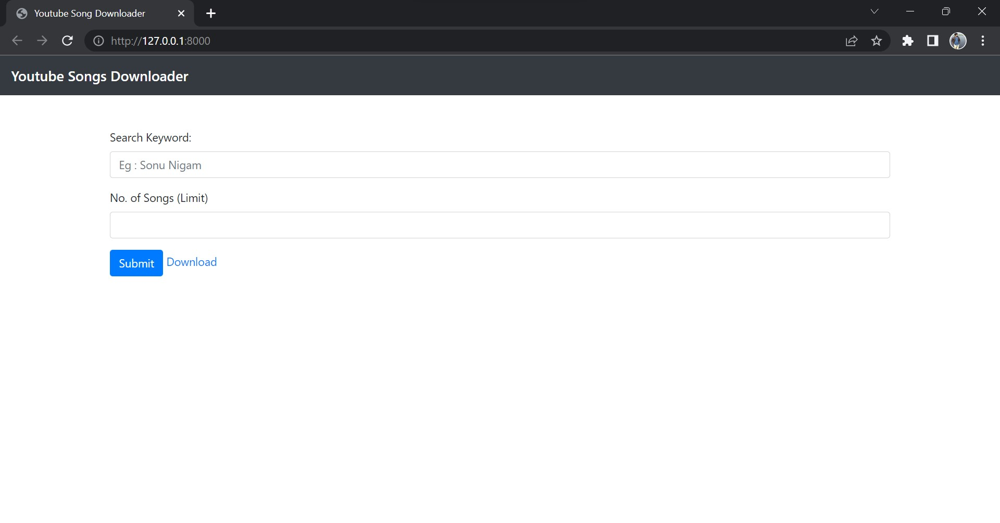

# Youtube Song Downloader ▶️ 📥

A simple python flask application to download youtube songs and send them to specified email id.

Deployed at http://thisisnaman.pythonanywhere.com/

## Dependencies

```
pip install pytube
pip install flask
pip install pydub
```


## Usage 

1. Set the credentials in the credentials.py file from which the songs will be sent to the desired email id.
2. Make sure to allow desired google account permissions for sending emails using python.
3. Run : python app.py


## Screenshots 




## Made with ❤️</>
